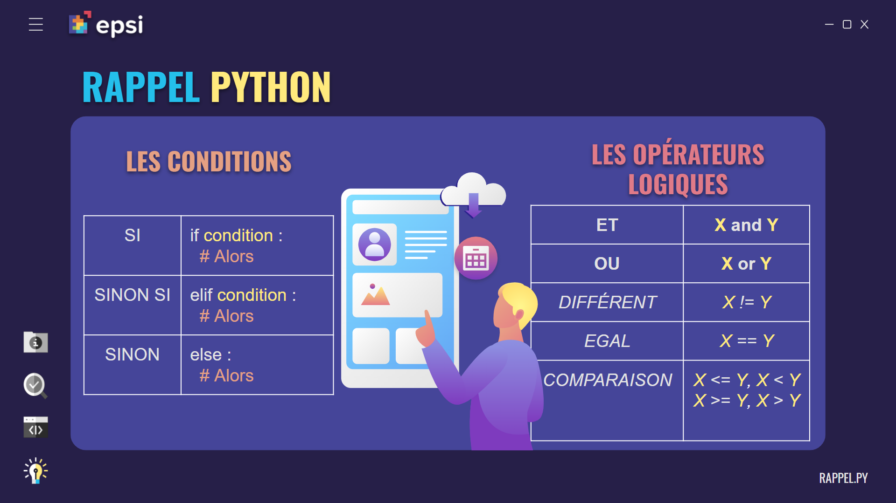
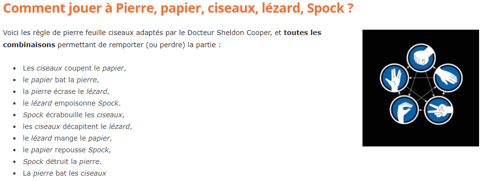

# Shifumi pour la JPO

> **À la fin de chaque JPO n'hésiter pas à ouvrir une issue sur le github pour contribuer à l'amélioration de l'atelier**
> 
>[Ouvrir une issue pour un récap](https://github.com/louis-ducruet/JPO-Shifumi/issues/new?assignees=louis-ducruet&labels=R%C3%A9cap+JPO&template=r-sum--de-la-jpo.md&title=%5BR%C3%A9cap+JPO%5D+%3A+31%2F12%2F2000)

## Présentation du projet

Script de l'atelier Python pour la JPO EPSI Nantes. 
L'objectif est de compléter les conditions de victoire du shifumi.

(Durée : 30 min)
[Lien du modèle de diapo de l'atelier](https://docs.google.com/presentation/d/11WMAlkuY-EaasJS3OAQxBNtRtPIiSXcbwbYN2b9HRKc/edit?usp=sharing)

Avec 3 niveaux de difficulté :
- **Niveau Padawan** : Completer les conditions 
- **Niveau Jedi** : Completer les conditions et les actions des conditions
- **Niveau Dark Vador** : Comme niveau Jedi mais avec seulement 5 conditions (else compte comme 1 condition)

## Aide dans la réalisation de l'atelier

Le fichier *aide.png* est disponibles avec les scripts pour que tous les participants puisse s'en servir.

## Bonus possible

Fonctionnalité à ajouter après la complétion de la tache principale :
1. Rendre le joueur 2 autonome (PNJ)
2. Faire choisir le nom de chaque joueur
3. Ajouter des couleurs au nom des joueurs [documentation (16 Colors in Raw Python)](https://stackabuse.com/how-to-print-colored-text-in-python/#16colorsinrawpython)
4. Modification des règles pour s'adapter à la version Pierre, Papier, Ciseaux, Lézard, Spock 

